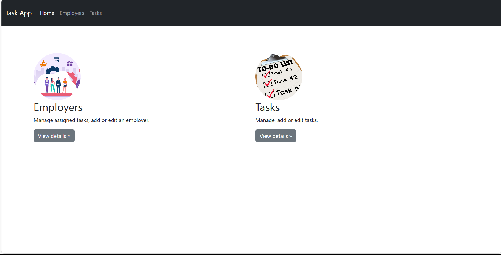
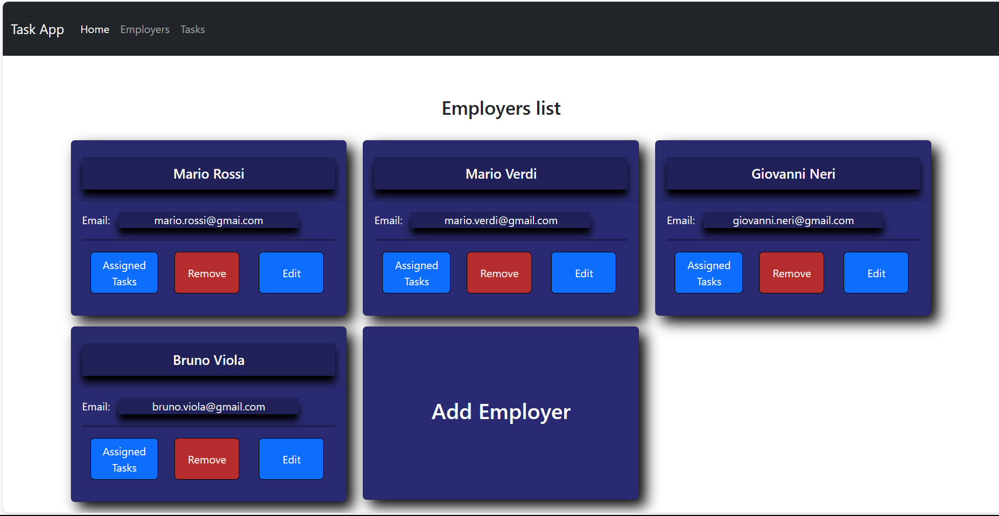
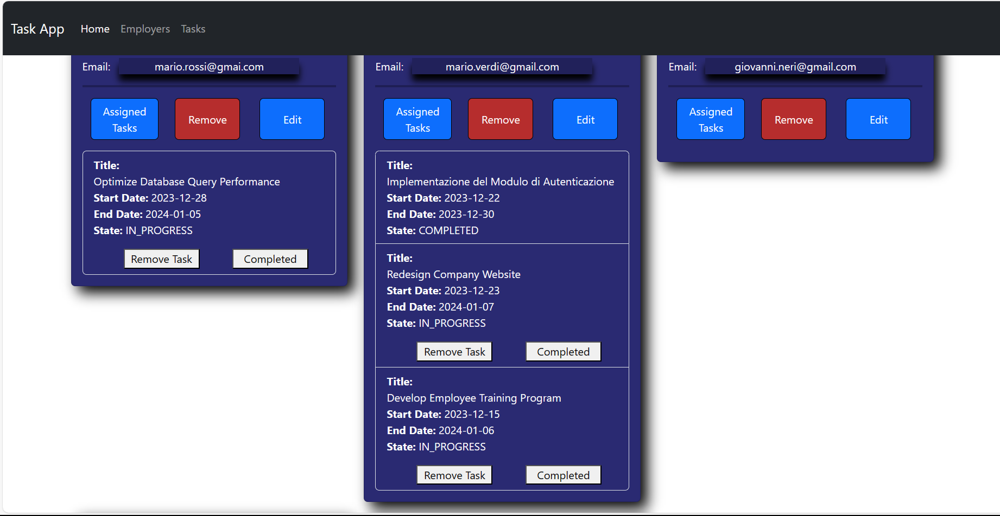
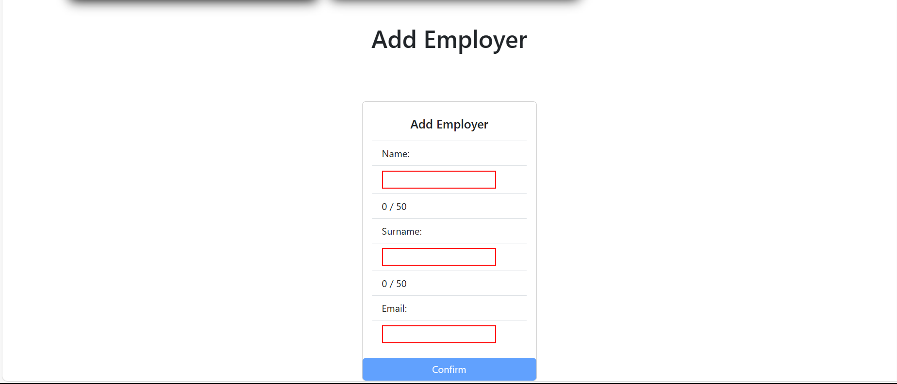
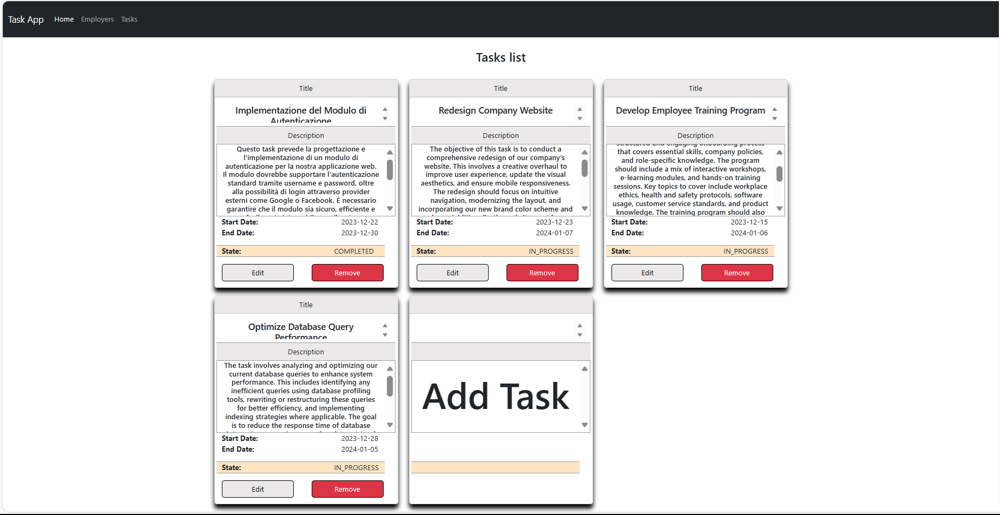
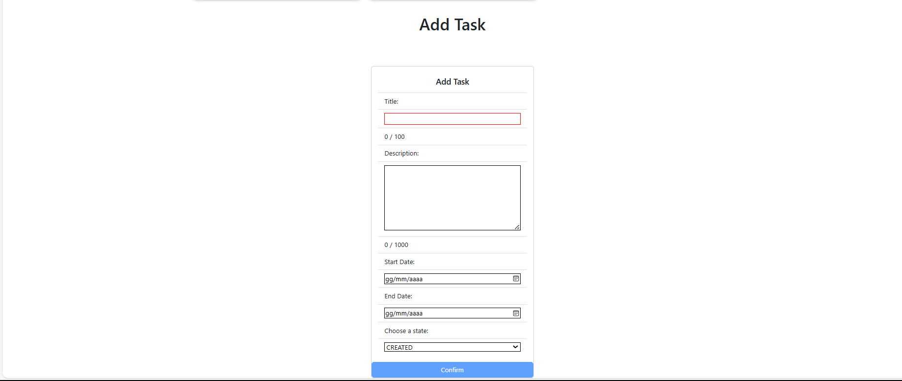
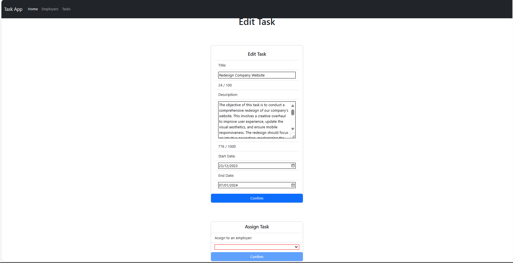

# Task-Project

## Description 

This individual project is a full-stack system designed for creating new tasks and assigning them to an employer.
Each newly created task is initially in a "CREATED" state and can be allocated to an employee. Upon assignment, tha task's status changes to "IN_PROGRESS".
While the task is IN_PROGRESS, it can be removed from the employer's task list and his state returns back to "CREATED".
Once the button "complete" is clicked the task's state become "COMPLETED". A Completed task couldn't be reassigned to other employers, thus permanently remaining in the task list of the employee who completed it.

This project was developed as part of the "Full-Stack Developer in Cloud" training course, supported by Bit SPA, which provided educational materials and staff, funded by FormaTemp and organized by ForPiù and promoted by Lavoropiù SPA.

## Technologies Used

1. Angular Version 17.0.0
2. Node.JS Version 10.2.3
3. Spring Boot Web Version 3.2.0
4. Spring Boot JPA Version 3.2.0
5. Hibernate Version 6.0.6
6. Java Version 17
7. MySQL Version 8.0.35

## Installation and Setup

### Frontend on Windows

Install Node.js: Download and install it from nodejs.org.

Install a Code Editor (Optional): Download and install VS Code from code.visualstudio.com.

Setting Up the Project
Open the Project:

If you installed VS Code, launch it and go to File > Open Folder. Select the folder containing the Frontend project.
If you’re not using a code editor, just navigate to the project folder using your file system.
Install Dependencies:

Open a terminal in the project's root directory. In VS Code, you can open a terminal in the editor itself.
Run the command npm install. This will install all the necessary packages and dependencies defined in the project's package.json file.

To correctly visualize the HTML, install Bootstrap by typing npm install bootstrap in the terminal. 
This command installs the latest version of Bootstrap.

Running the Project

Start the Development Server:
In the same terminal, run the command ng serve or npm start (depending on how the project is configured). This will start the Angular development server.
Wait for the compilation to complete.
Access the Application:

Once the server is running, open a web browser.
Navigate to http://localhost:4200 (or the port number specified in the terminal).

### Backend on Windows

Install Java Development Kit (JDK): Spring Boot requires a Java Development Kit. You can download and install the JDK from Oracle's website or adopt an open-source version like OpenJDK.

Install Eclipse IDE: Download and install Eclipse, preferably the version that supports Java Enterprise Edition, from eclipse.org.

Install Spring Tools 4 for Eclipse: This can be done from within Eclipse by navigating to Help > Eclipse Marketplace, then searching for "Spring Tools 4" and installing it. This set of tools provides enhanced support for developing Spring applications.

Open Eclipse and go to your workspace.

Import the Spring Boot Project:
Choose File > Import.
Select Existing Maven Projects under the Maven category.

Navigate to the root directory of your Spring Boot project and select it.
Eclipse will detect the pom.xml file. Ensure it's checked and click Finish.

Resolve Dependencies:
Right-click on the project in the Project Explorer.
Select Maven > Update Project. This will ensure all Maven dependencies are downloaded and added to the project.
Running the Project

Run the Application:
Right-click on the project in the Project Explorer.

Go to Run As > Spring Boot App. Alternatively, if you have a main method in your application, you can also select Run As > Java Application.

The console will display the output, indicating that the server has started.

Access the Application:
Once the application is running, you can access its endpoints as configured (usually via http://localhost:8080 or the port you specified in your application properties).

### Database MySQL e MySQL Workbench

How to Install MySQL server and MySQL Workbench

1. https://www.mysql.com/it/
2. Navigate to the Download section at the bottom of the page, then go to the "MySQL Community Server" subsection.
3. Choose the MySQL version you prefer, and consider using the MySQL Installer for Windows instead of downloading the full archive.
4. Once the intaller is opened download MySQL Server version 8.0.35 or above.
5. Also, download MySQL Workbench, ideally version 8.0.34.
6. After installation, open "Task Manager" and under the Services tab, look for "MySQL80" to ensure it is running.
7. Ensure that the MySQL80 server is listening on port 3306.
8. Using MySQL Workbench, create a new connection using 'root' as the user and '0_mysql_1' as the password. Alternatively, create a custom connection with a different username and password, but then you should modify the file located at src/main/resources -> application.properties in the backend application.
9.  spring.datasource.url=${DATABASE_URL:jdbc:mysql://localhost:3306/<database_name>}
    spring.datasource.username=${DATABASE_USER:<connection_user>}
    spring.datasource.password=${DATABASE_PWD:<connection_password>}
10. Create a database ensuring that its name matches the <database_name> specified in the application.properties file.

## Usage
<h1
  align="center">
  Application Main Menu.
   
   
     
</h1>
<h1
  align="center">
  Employers List.
   
   
   
</h1>
<h1
  align="center">
  Assigned Task List Sample.
   
   
  
</h1>
<h1
  align="center">
  Employers Form sample.
   
   
  
</h1>
<h1
  align="center">
  Tasks List.
   
   
    
</h1>
<h1
  align="center">
  Task Form Sample.
   
   
    
</h1>
<h1
  align="center">
  Task Edit Form Sample.
   
   
    
</h1>